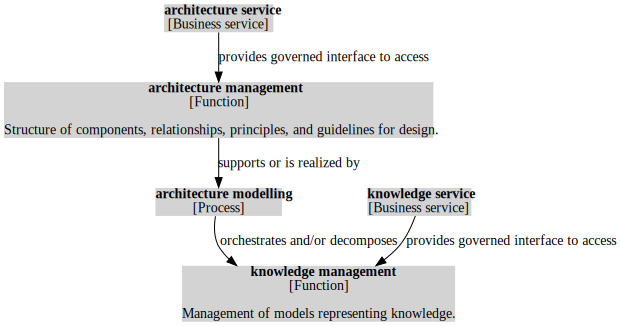

# Business architecture tooling

## Purpose

Exploring tooling to combine knowledge graphs from code bases, ontologies, and configuration management databases.

While this may also be useful for application architecture modelling, it seems like in that area more best practices and supporting frameworks have already been developed. In business architecture, we may need evolving and probabilistic models to match the practical uncertainties of business.

## Plan

Intended first workflow:

1. Create a temporary dataset.
2. Import the [TOGAF Content Metamodel graph](https://www.researchgate.net/publication/220708864_Towards_the_Formalisation_of_the_TOGAF_Content_Metamodel_using_Ontologies).
3. Import some custom (`.ttl`) business architecture graph, listing `business service`s, `product`s, and supporting `application service`s, with reference to the TOGAF Content Metamodel. See for example [architecture.ttl](architecture.ttl).
4. Query for `business architecture` data, relating `product`s to `business service`s to `application service`s.
5. Render the `business architecture` using Graphviz.
6. Delete the temporary dataset.

When the business architecture graph is kept in version control with CI/CD support, the program should run in CI/CD and upload its resulting `business architecture` data to some object store.

## Example

In: [architecture.ttl](architecture.ttl). Out:

## Technology

This project uses:

- Rust for integrated development with clear domain modeling capabilities (e.g. algebraic data types, traits).
- Apache Jena Fuseki for knowledge management implementation.
- Graphviz for architecture diagram rendering.
- Docker for easily setting up a local development environment.

## To run

1. In the current project’s root folder, run `docker-compose run` and keep it running.
2. In the current project’s root folder, run `./download-togaf.sh`.
3. In the current project’s root folder, run `cargo run`.

Note: at the time of~~~~ writing only the workflow above is implemented, with steps missing.